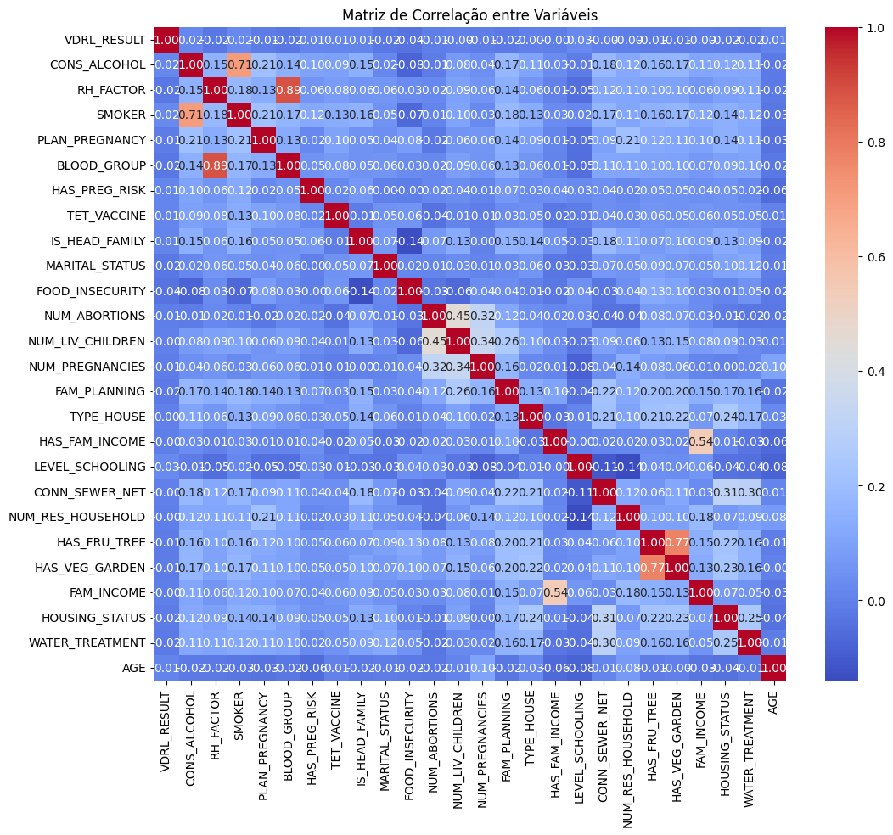
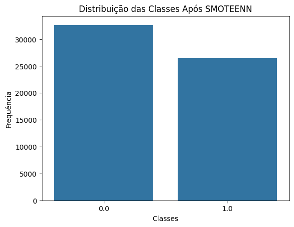
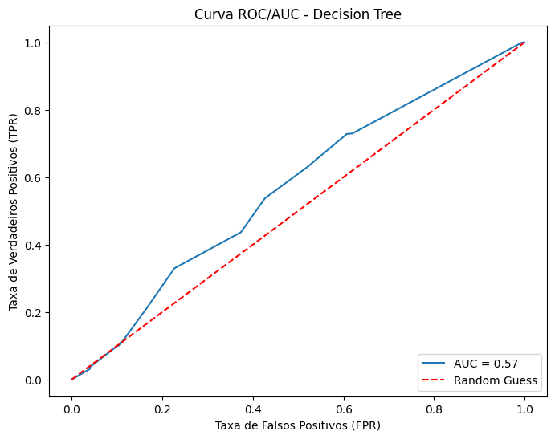
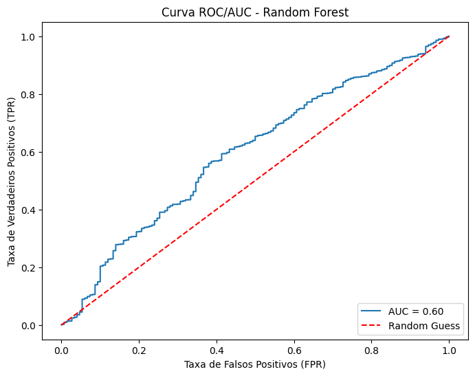
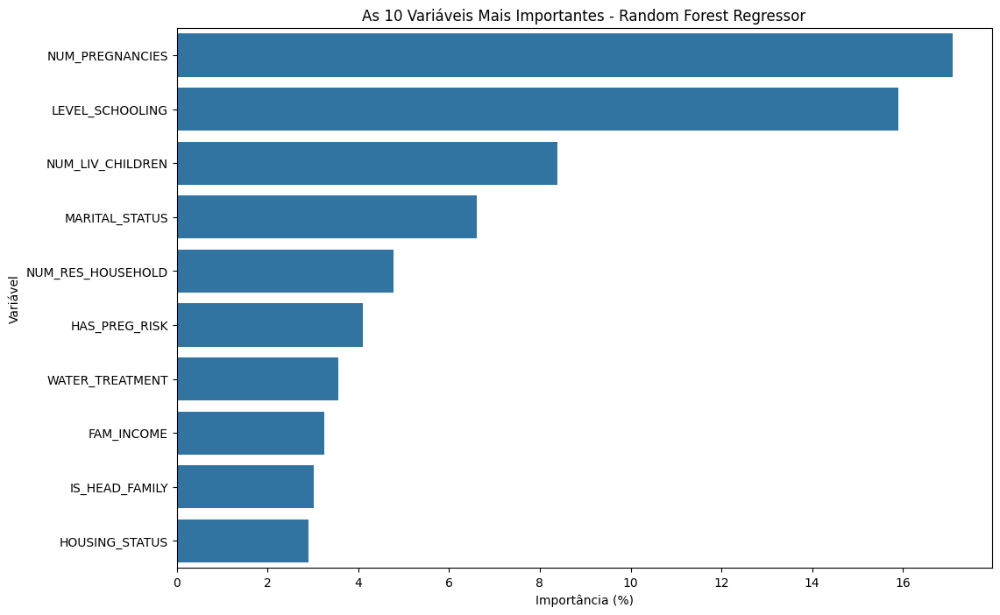
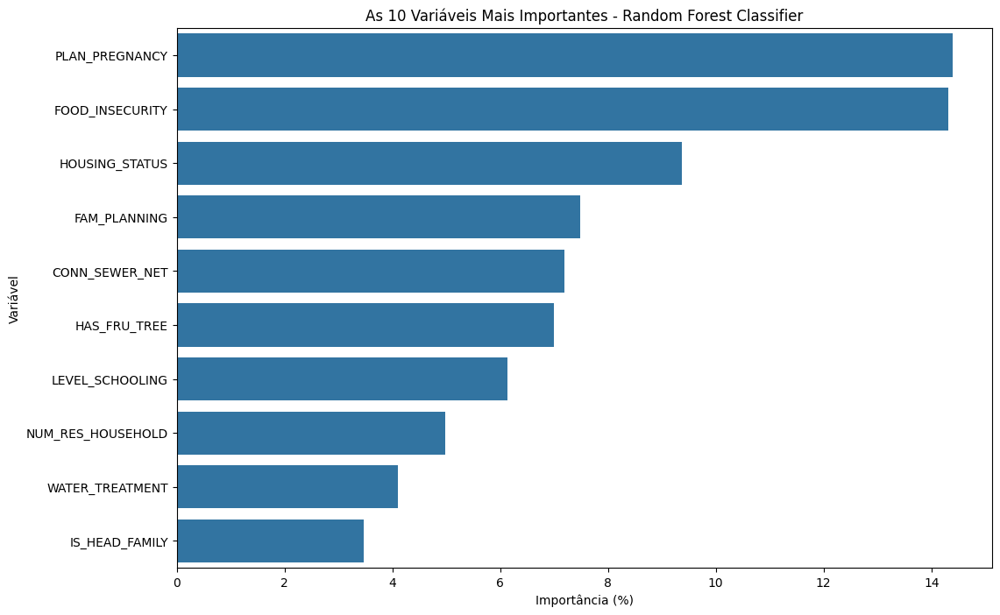

# Avaliação de Machine Learning

## Relatório Final: Análise de Sífilis Congênita

### 1. Introdução

A sífilis congênita é uma condição grave e evitável, resultante da transmissão vertical de sífilis de uma mãe infectada para o feto. Apesar dos esforços em saúde pública, o número de casos permanece elevado, especialmente em regiões com acesso limitado a cuidados pré-natais e educação em saúde. Este estudo utiliza técnicas de aprendizado de máquina para explorar fatores clínicos e sociodemográficos associados aos desfechos de sífilis congênita, com o objetivo de propor intervenções para prevenção e controle.

### Objetivos

- **Geral**: Investigar fatores clínicos e sociodemográficos associados à ocorrência de sífilis congênita no Brasil entre 2013 e 2021.
- **Específicos**:
  - Analisar a distribuição e correlação das variáveis no dataset.
  - Construir modelos de classificação para prever o resultado do exame VDRL.
  - Identificar os fatores mais influentes nos modelos preditivos.
  - Propor intervenções baseadas nos insights obtidos.

### Integrantes do Projeto

- Lorenzo Marcelino - [@Lorenzo](https://github.com/lorenzomarcelino)
- Hugo Campelo - [@hcmr1808](https://github.com/hcmr1808)
- Leonardo Medeiros - [@LeoMedeirosss](https://github.com/LeoMedeirosss)

---

### 2. Dataset e Pré-Processamento

#### 2.1. Fonte dos Dados

- **Nome**: Clinical and sociodemographic data on congenital syphilis cases, Brazil, 2013-2021.
- **Fonte**: Disponível no repositório Mendeley.

#### 2.2. Descrição do Dataset

O dataset compreende 41.762 registros de casos de sífilis congênita, com 26 variáveis relacionadas a condições clínicas, demográficas e socioeconômicas.

- **Variáveis Principais**:
  - `VDRL_RESULT`: Resultado do exame VDRL (positivo ou negativo).
  - `AGE`: Idade da mãe.
  - `CONS_ALCOHOL`, `SMOKER`: Consumo de álcool e tabaco.
  - `PLAN_PREGNANCY`: Planejamento da gravidez.
  - Outras variáveis relacionadas a condições de moradia, renda, escolaridade, etc.

#### 2.3. Processos de Pré-Processamento

##### 2.3.1. Identificação e Tratamento de Valores Ausentes

- **Análise Inicial**: Identificou-se valores ausentes em algumas variáveis.
- **Ações Tomadas**:
  - Imputação de valores faltantes nas variáveis numéricas com a média.
  - Imputação nas variáveis categóricas com a moda.

##### 2.3.2. Análise de Correlação e Distribuição

- **Correlação**: Realizada análise de correlação para identificar relações lineares entre variáveis.
- **Distribuição da Variável-Alvo**:
  - Observou-se desbalanceamento na variável `VDRL_RESULT`, com predominância de resultados positivos.

##### 2.3.3. Tratamento do Desbalanceamento

- **Problema**: Desbalanceamento significativo entre as classes da variável-alvo.
- **Solução**: Aplicação do método SMOTEENN (Synthetic Minority Over-sampling Technique and Edited Nearest Neighbors) para balancear o dataset.

---

### 3. Metodologia

#### 3.1. Modelos Utilizados

##### 3.1.1. Classificação

- **Decision Tree**:
  - Escolhido pela interpretabilidade e capacidade de capturar interações não lineares entre variáveis.
- **Random Forest**:
  - Selecionado por combinar múltiplas árvores de decisão, aumentando a robustez e reduzindo o overfitting.

##### 3.1.2. Regressão

- **Regressão Linear**:
  - Utilizada como baseline para modelar relações lineares entre variáveis e a idade (`AGE`).
- **Random Forest Regressor**:
  - Aplicado para capturar relações não lineares e interações complexas entre variáveis.

#### 3.2. Estratégias de Validação

- **Validação Cruzada (k-fold)**:
  - Aplicada com k=5 para avaliar a generalização dos modelos.
- **Métricas de Avaliação**:
  - **Classificação**:
    - Precisão, Recall, F1-Score, AUC (Área sob a Curva ROC).
  - **Regressão**:
    - MAE (Mean Absolute Error), RMSE (Root Mean Squared Error), MAPE (Mean Absolute Percentage Error).

---

### 4. Resultados

#### 4.1. Classificação

##### 4.1.1. Decision Tree

- **F1-Scores com Validação Cruzada**: [0.76, 0.79, 0.78, 0.79, 0.79]
- **Média do F1-Score**: 0.782

_Tabela 1: Relatório de Classificação - Decision Tree_

| Classe              | Precisão | Recall | F1-Score | Suporte |
| ------------------- | -------- | ------ | -------- | ------- |
| 0.0                 | 0.03     | 0.39   | 0.05     | 150     |
| 1.0                 | 0.98     | 0.73   | 0.84     | 8203    |
| **Acurácia**        |          |        | **0.72** | 8353    |
| **Média Macro**     | 0.51     | 0.56   | 0.44     |         |
| **Média Ponderada** | 0.97     | 0.72   | 0.82     |         |

##### 4.1.2. Random Forest

- **F1-Scores com Validação Cruzada**: [0.93, 0.98, 0.98, 0.98, 0.98]
- **Média do F1-Score**: 0.970

_Tabela 2: Relatório de Classificação - Random Forest_

| Classe              | Precisão | Recall | F1-Score | Suporte |
| ------------------- | -------- | ------ | -------- | ------- |
| 0.0                 | 0.02     | 0.06   | 0.03     | 150     |
| 1.0                 | 0.98     | 0.95   | 0.97     | 8203    |
| **Acurácia**        |          |        | **0.94** | 8353    |
| **Média Macro**     | 0.50     | 0.51   | 0.50     |         |
| **Média Ponderada** | 0.97     | 0.94   | 0.95     |         |

##### 4.1.3. Comparação dos Modelos

- **Decision Tree** apresentou desempenho moderado, com F1-Score médio de 0.782.
- **Random Forest** superou a Decision Tree, com F1-Score médio de 0.970 e maior acurácia.

#### 4.2. Regressão

##### 4.2.1. Regressão Linear

- **MAE**: 4.07
- **RMSE**: 5.22
- **MAPE**: 17.63%

##### 4.2.2. Random Forest Regressor

- **MAE**: 2.85
- **RMSE**: 4.16
- **MAPE**: 12.19%

##### 4.3. KNN

                precision    recall  f1-score   support

         0.0       0.00      0.00      0.00       234
         1.0       0.98      1.00      0.99     12295

    accuracy                            0.98     12529
    macro avg       0.49      0.50      0.50     12529
    weighted avg    0.96      0.98      0.97     12529

- **Acurácia** : 0.9811637002155

#### 4.4. Importância das Variáveis

- **Variáveis mais influentes na Classificação**:
  1. `PLAN_PREGNANCY` (Planejamento da gravidez): 14.40%
  2. `FOOD_INSECURITY` (Insegurança alimentar): 14.31%
  3. `HOUSING_STATUS` (Situação de moradia): 9.37%
  4. `FAM_PLANNING` (Planejamento familiar): 7.48%
  5. `CONN_SEWER_NET` (Conexão à rede de esgoto): 7.18%
  6. `CONS_ALCOHOL` (Consumo de álcool): 6.44%
  7. `EDUCATION` (Escolaridade): 6.22%
  8. `PRENATAL` (Pré-natal): 5.60%
  9. `SMOKER` (Tabagismo): 5.36%
  10. `AGE` (Idade): 5.01%

---

### 5. Discussão e Recomendações

#### 5.1. Interpretação dos Resultados

Os modelos indicam que fatores socioeconômicos e comportamentais têm grande influência na ocorrência de sífilis congênita.

- **Planejamento da Gravidez**: A ausência de planejamento aumenta o risco, indicando a necessidade de educação em planejamento familiar.
- **Insegurança Alimentar**: Reflete condições socioeconômicas precárias, associadas a menor acesso a serviços de saúde.
- **Situação de Moradia**: Moradias inadequadas podem estar relacionadas a menor acesso a saneamento básico e informações de saúde.

#### 5.2. Recomendações

##### 5.2.1. Políticas de Saúde Pública

- **Educação e Conscientização**:

  - Campanhas sobre a importância do planejamento familiar.
  - Programas educacionais focados em saúde reprodutiva e prevenção de ISTs.

- **Melhoria das Condições Socioeconômicas**:

  - Investimento em programas de segurança alimentar.
  - Melhoria das condições habitacionais e acesso a saneamento básico.

- **Acesso aos Serviços de Saúde**:
  - Ampliação da cobertura de cuidados pré-natais.
  - Disponibilização de testes e tratamento para sífilis em unidades básicas de saúde.

##### 5.2.2. Monitoramento e Avaliação

- **Sistemas de Vigilância**:
  - Fortalecimento dos sistemas de notificação e monitoramento de casos.
  - Utilização de modelos preditivos para identificar áreas de maior risco.

---

### 6. Conclusão

Este estudo demonstrou a eficácia de técnicas de aprendizado de máquina na identificação de fatores associados à sífilis congênita. Os modelos construídos, especialmente o Random Forest, apresentaram alto desempenho na predição do resultado do exame VDRL.

Os insights obtidos ressaltam a importância de intervenções focadas em educação, melhoria das condições socioeconômicas e ampliação do acesso aos serviços de saúde. Recomenda-se que futuras pesquisas explorem modelos mais avançados e considerem dados regionais para estratégias mais direcionadas.

---

### 7. Repositório do Código

O código do projeto está disponível no repositório [GitHub](https://github.com/LeoMedeirosss/ML_Test).

---

### 8. Referências

**Artigo**:  
TEIXEIRA, Igor; LEITE, Morgana; MELO, Flávio; ROCHA, Elisson; HADJ SADOK, Sara; SANTANA, Marília; MORAIS, Cleber; KELNER, Judith; ENDO, Patricia Takako. _Predicting congenital syphilis cases: A performance evaluation of different machine learning models_. PLOS ONE, v. 17, n. 10, 2022. Disponível em: <https://doi.org/10.1371/journal.pone.0276150>. Acesso em: 16 nov. 2024.

**Dataset**:  
TEIXEIRA, Igor; LEITE, Morgana; MELO, Flávio; ROCHA, Elisson; HADJ SADOK, Sara; SANTANA, Marília; MORAIS, Cleber; KELNER, Judith; ENDO, Patricia Takako. _Clinical and sociodemographic data on congenital syphilis cases, Brazil, 2013-2021_. Mendeley Data, v. 1, 2022. Disponível em: <https://doi.org/10.17632/3zkcvybvkz.1>. Acesso em: 16 nov. 2024.
